# DA36-mini3-dl3

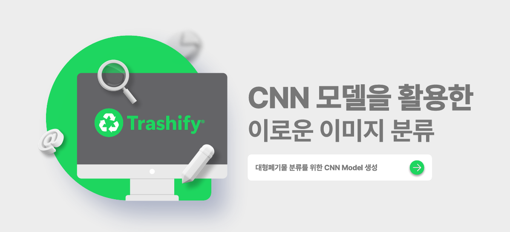
------
## 목차
1. 프로젝트 개요
2. 개발배경
3. 시장조사
4. 데이터 취득
5. 데이터 전처리
6. 모델 학습
7. 기대효과
8. 시연 
------
## 프로젝트 개요

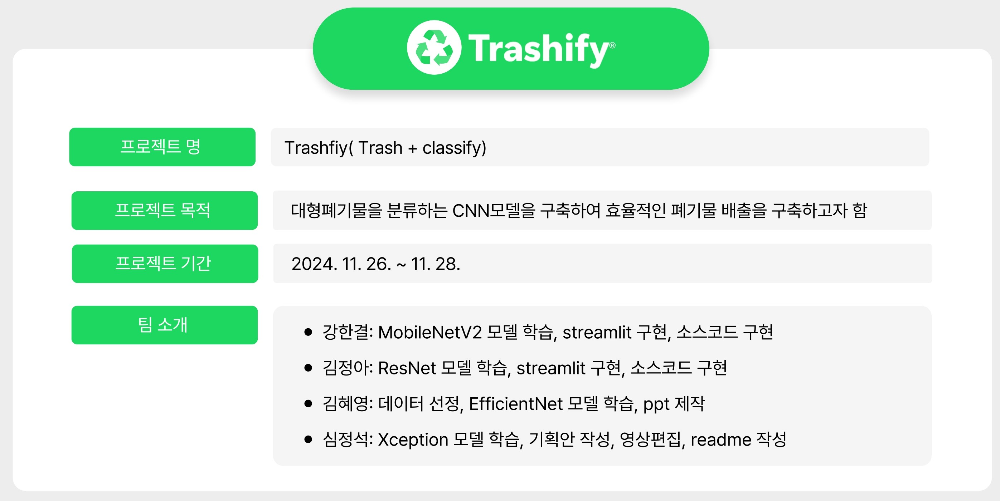

------
## 개발배경

**개발 목적:** 
- 대형폐기물을 분류하는 CNN모델을 구축하여 효율적인 폐기물 배출을 구축하고자 함
------

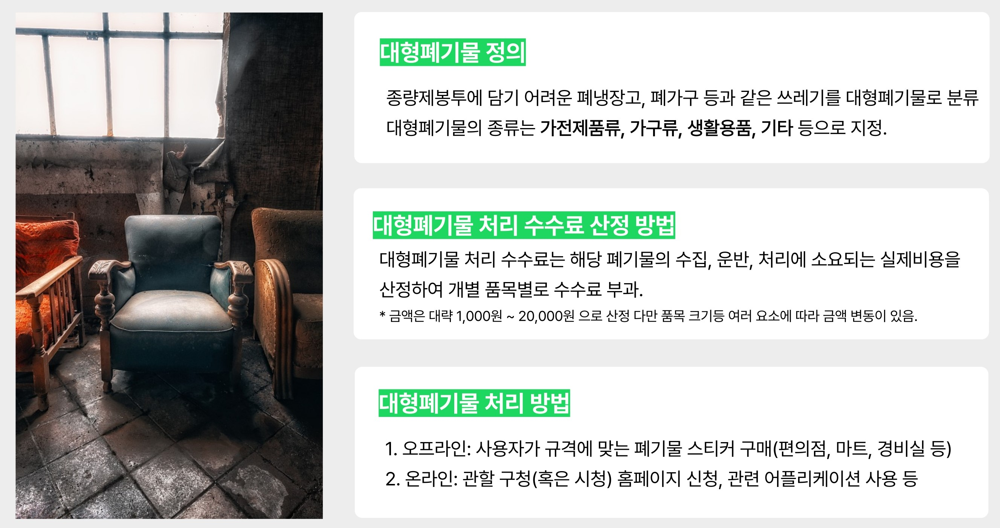

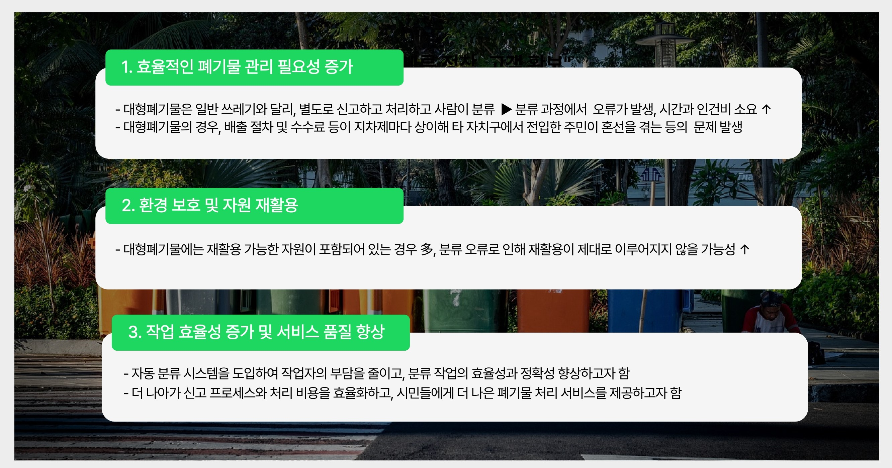

------
## 시장조사

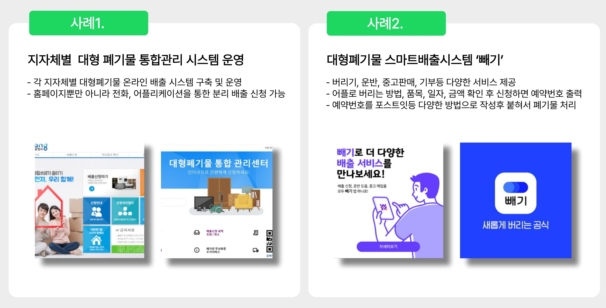

------
## 데이터 취득

Ai hub - 생활 폐기물 이미지:
https://www.aihub.or.kr/aihubdata/data/view.do?currMenu=115&topMenu=100&dataSetSn=140

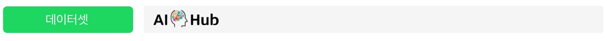

------
## 데이터 전처리

- 전체 데이터셋은 용량이 크므로 전체 15종의 카테고리중에서 가구류 4종으로 선택
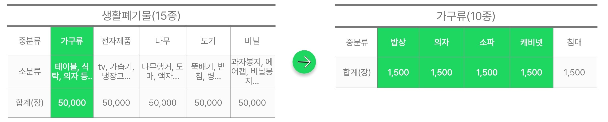
 
 
- 계산 시간과 메모리 사용량을 줄이기 위해 이미지를 224, 224 크기로 리사이즈
 
 
- 학습중 GPU 메로리를 더 효율적으로 활용하기 위해 사전 처리

------
## 모델 학습

- 강한결: MobileNetV2
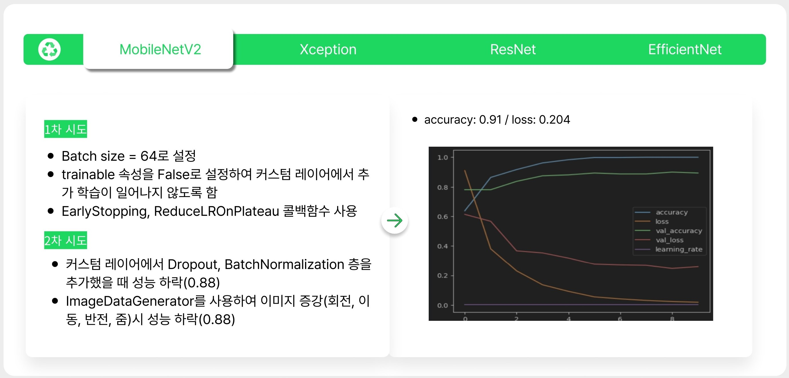 
 
  
- 김정아: ResNet50V2
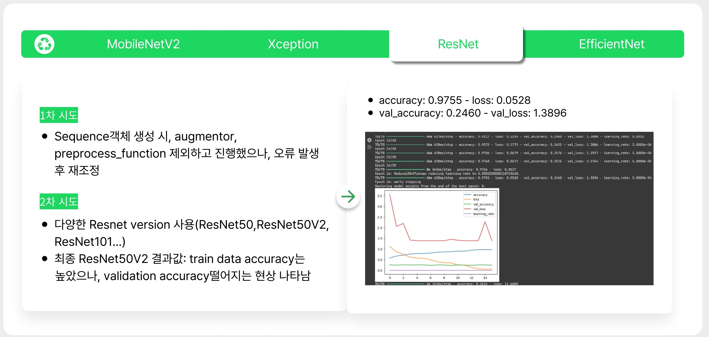
 
 
- 김혜영: EfficientNet
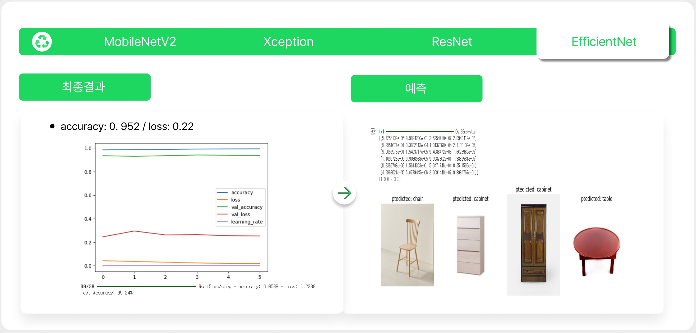
 
 
- 심정석: Xception
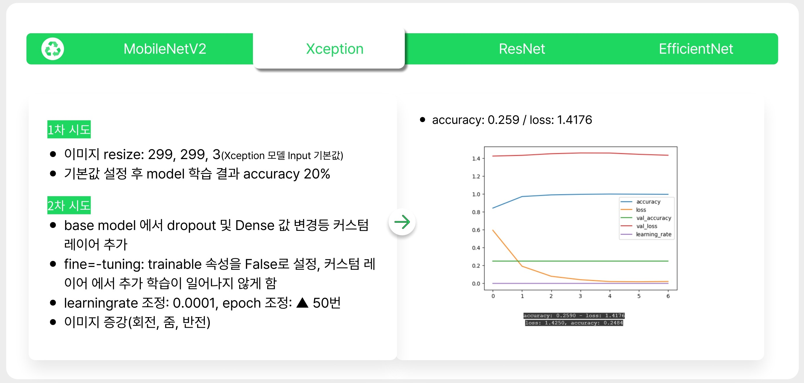

------
## 기대효과

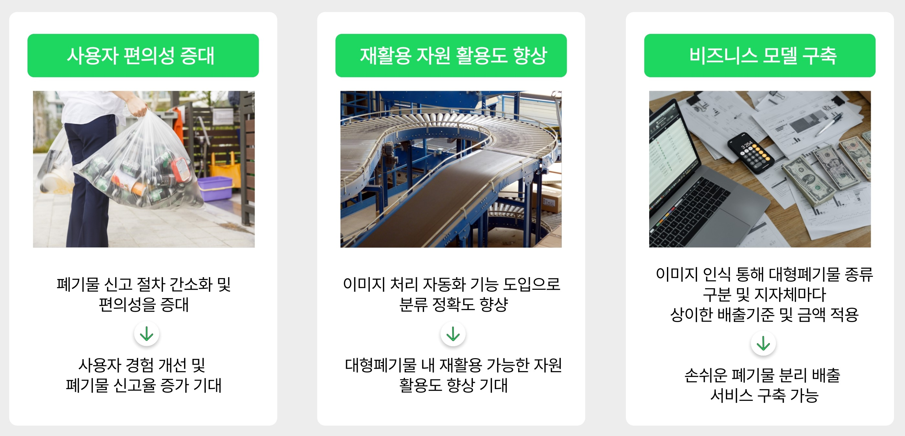

------
## 시연 영상

- 이미지 클릭

------
## 소감 

**강한결** 
- 프로젝트가 수업 때 잘 이해하지 못했던 부분들을 채워나가는 데에 많은 도움이 되었다.
- 팀 단위로 여러 차례 공부하면서 파이썬 코드에 대한 전반적인 이해도가 많이 향상된 것 같다.

**김정아**
- 이미지 분류를 통한 정확도를 높이는게 생각보다 어려웠지만 조금씩 올라갈 때마다 개운해지는 기분이 들었다. 
- 팀원분들과 의논하면서 공부도 많이 되고, 의지가 되었고, streamlit을 처음해봤는데 생각보다 어려웠고 구현되고나니까 속이 후련해졌다.

**김혜영**
- 수집한 이미지를 로드하는 것 부터, 해당 이미지를 불러와서 작업하는 과정까지 직접 학습할 수 있어 도움이 됨
- 모델 성능 향상 (layer 조정, 데이터 증강, finetuning 등)에 초점을 맞춰 진행하다 보니, 보이지 않던 부분에서 문제가 생겼던 것을 확인하지 못했으며, problem solving을 작성하며 해결해 나아가니 틀린 부분을 기록하고 효율적으로 학습할 수 있었음

**심정석**
- 좋았던 부분: 하이퍼 파라미터 기능과 레이어 개념을 이해하고 수업때 배우지 않았던 다른 모델로 학습 시도를 해볼수 있어서 좋았음
- 힘들었던 부분: 다양한 방법으로 정확도를 높이려 했으나 실패하고 원인을 몰라 답답했던 점 
